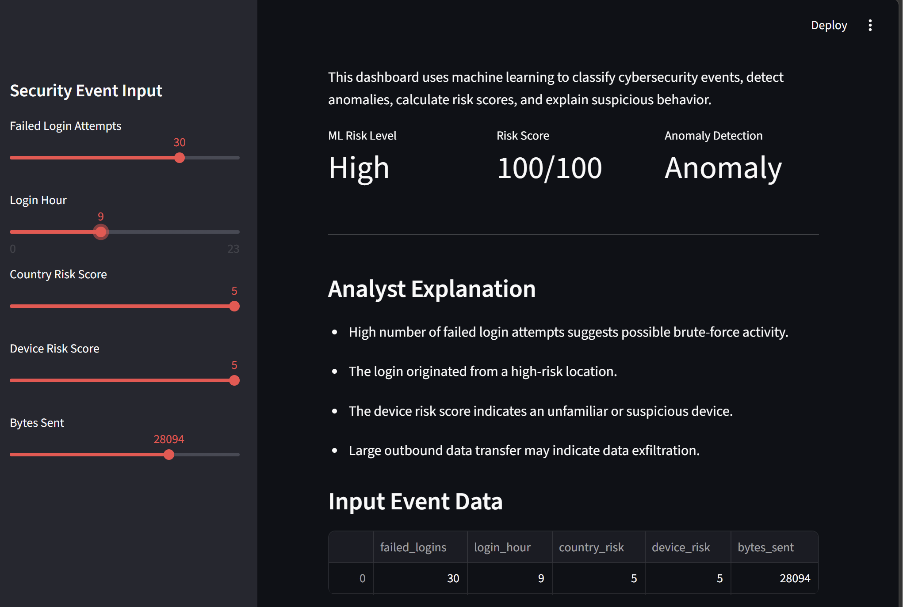
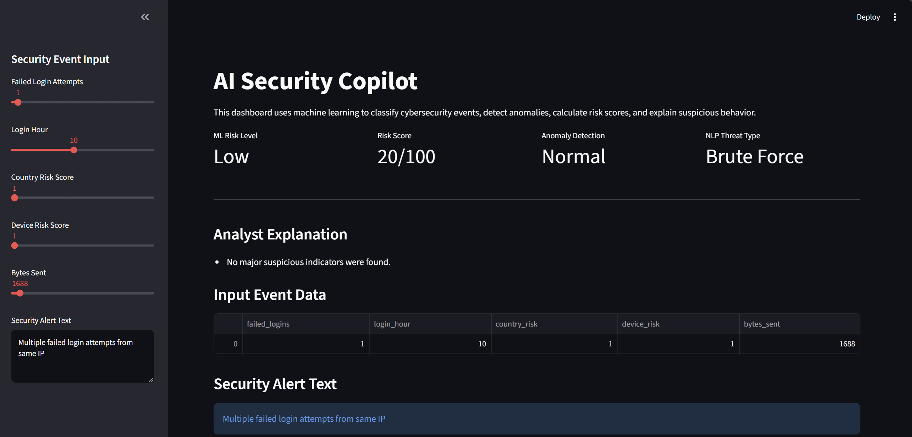

# AI Security Copilot

AI-powered cybersecurity risk analysis dashboard built with Python, Scikit-Learn, and Streamlit.

## Overview

AI Security Copilot is a machine learning project that analyzes simulated security events and classifies them as Low, Medium, or High risk.

The system combines:

- Machine Learning Risk Classification
- Anomaly Detection
- Cybersecurity Risk Scoring
- Explainable Security Analytics
- Interactive Dashboard Visualization

---

## High-Risk Security Event



---

## Normal User Activity



---

## Features

- Random Forest risk classification
- Isolation Forest anomaly detection
- Custom cybersecurity risk scoring engine
- Explainable analyst-style security explanations
- Interactive Streamlit dashboard
- Real-time security event analysis

---

## Technologies Used

- Python
- Pandas
- NumPy
- Scikit-Learn
- Streamlit
- Matplotlib
- Joblib

---

## Project Architecture

```text
Security Event Data
        ↓
Feature Engineering
        ↓
Random Forest Classifier
        ↓
Risk Prediction
        ↓
Risk Scoring Engine
        ↓
Analyst Explanations
        ↓
Streamlit Dashboard
```

---

## Input Features

The model analyzes the following security indicators:

| Feature | Description |
|----------|------------|
| Failed Logins | Number of failed login attempts |
| Login Hour | Time of login activity |
| Country Risk | Risk score of login location |
| Device Risk | Risk score of the device |
| Bytes Sent | Amount of network activity |

---

## Outputs

The dashboard provides:

- Low / Medium / High Risk Classification
- Risk Score (0-100)
- Anomaly Detection
- Analyst Explanation
- Data Visualization

---

## Example High-Risk Event

Example input:

```text
Failed Login Attempts: 30
Login Hour: 9
Country Risk Score: 5
Device Risk Score: 5
Bytes Sent: 25000
```

Example output:

```text
ML Risk Level: High
Risk Score: 100/100
Anomaly Detection: Anomaly
```

---

## Skills Demonstrated

- Machine Learning
- Data Science
- Cybersecurity Analytics
- Risk Analysis
- Feature Engineering
- Model Evaluation
- Explainable AI
- Dashboard Development
- Git & GitHub

---

## How to Run

Install dependencies:

```bash
pip install -r requirements.txt
```

Create dataset:

```bash
python create_data.py
```

Train models:

```bash
python train_model.py
```

Run dashboard:

```bash
python -m streamlit run app.py
```

---

## Future Improvements

- NLP-based threat classification
- Real security log ingestion
- Cloud deployment
- Threat intelligence integration
- Advanced anomaly detection

---

## Author

**Shraiya Rajput**

AI Security Copilot Project
