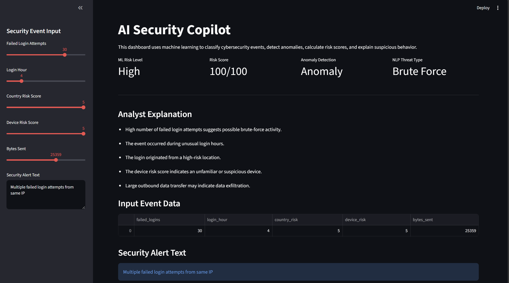
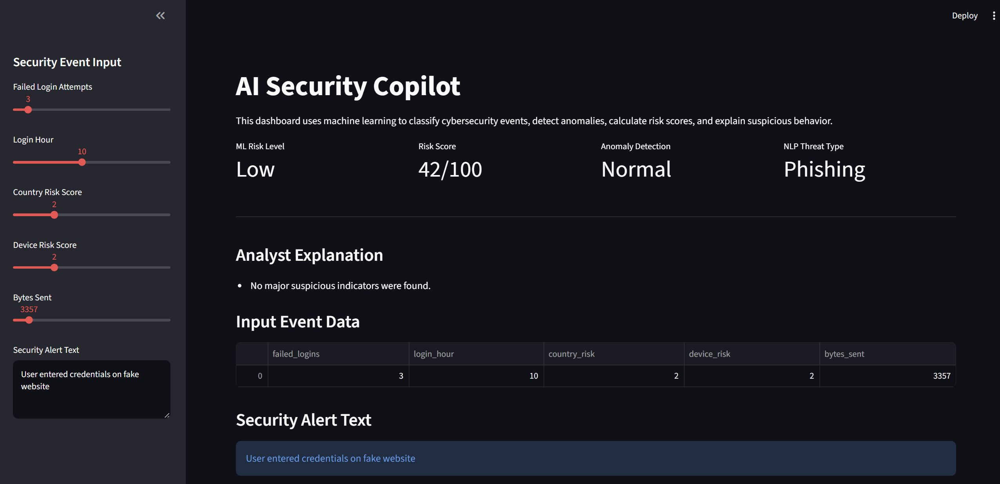

# AI Security Copilot

AI-powered cybersecurity analytics platform built with Python, Scikit-Learn, NLP, and Streamlit.

## Overview

AI Security Copilot analyzes security events and alert text to identify suspicious activity, classify risk levels, detect anomalies, and predict likely threat categories.

The system combines:

- Machine Learning Risk Classification
- Anomaly Detection
- NLP Threat Classification
- Cybersecurity Risk Scoring
- Explainable Security Analytics
- Interactive Dashboard Visualization

---

## High-Risk Attack Detection



---

## NLP Threat Classification



---

## Normal User Activity


---

## Features

- Random Forest risk classification
- Isolation Forest anomaly detection
- NLP-based threat classification
- Cybersecurity risk scoring engine
- Explainable analyst-style security explanations
- Interactive Streamlit dashboard
- Real-time security event analysis

---

## Technologies Used

- Python
- Pandas
- Scikit-Learn
- Streamlit
- Matplotlib
- Joblib
- Git & GitHub

---

## Project Architecture

```text
Security Event Data
        ↓
Feature Engineering
        ↓
Random Forest Classifier
        ↓
Risk Prediction
        ↓
Risk Scoring Engine
        ↓
Analyst Explanations
        ↓
Streamlit Dashboard

Security Alert Text
        ↓
TF-IDF Vectorization
        ↓
Logistic Regression Classifier
        ↓
Threat Type Prediction
```

---

## Input Features

The model analyzes the following security indicators:

| Feature | Description |
|----------|------------|
| Failed Logins | Number of failed login attempts |
| Login Hour | Time of login activity |
| Country Risk | Risk score of login location |
| Device Risk | Risk score of the device |
| Bytes Sent | Amount of network activity |
| Alert Text | Security alert message used for NLP classification |

---

## Outputs

The dashboard provides:

- Low / Medium / High Risk Classification
- Risk Score (0–100)
- Anomaly Detection
- NLP Threat Type Prediction
- Analyst Explanation
- Data Visualization

---

## Example High-Risk Event

### Example Input

```text
Failed Login Attempts: 30
Login Hour: 2
Country Risk Score: 5
Device Risk Score: 5
Bytes Sent: 25000

Alert Text:
Multiple failed login attempts from same IP
```

### Example Output

```text
ML Risk Level: High
Risk Score: 100/100
Anomaly Detection: Anomaly
NLP Threat Type: Brute Force
```

---

## Threat Categories Supported

The NLP classifier can identify:

- Brute Force
- Phishing
- Malware
- Ransomware
- Data Exfiltration

---

## Skills Demonstrated

- Machine Learning
- Natural Language Processing (NLP)
- Data Science
- Cybersecurity Analytics
- Risk Analysis
- Feature Engineering
- Model Evaluation
- Explainable AI
- Dashboard Development
- Git & GitHub

---

## How to Run

### Install Dependencies

```bash
pip install -r requirements.txt
```

### Generate Security Event Dataset

```bash
python create_data.py
```

### Train Security Models

```bash
python train_model.py
```

### Generate NLP Dataset

```bash
python create_nlp_data.py
```

### Train NLP Threat Classifier

```bash
python train_nlp_model.py
```

### Launch Dashboard

```bash
python -m streamlit run app.py
```

---

## Future Improvements

- Real security log ingestion
- Cloud deployment (AWS, Azure, or GCP)
- Threat intelligence integration
- Advanced anomaly detection
- Computer vision-based surveillance analytics
- Automated incident response workflows

---

## Author

**Shraiya Rajput**

AI Security Copilot — Machine Learning, NLP, and Cybersecurity Analytics Project
